# Request/Response Flow Diagrams

This document contains comprehensive Mermaid diagrams showing the request/response flow and function call sequences for all endpoints in the Manufacturing Calculation API v3.3.0.

## 1. Overall Request/Response Flow

This high-level diagram shows the complete flow from client request to response:

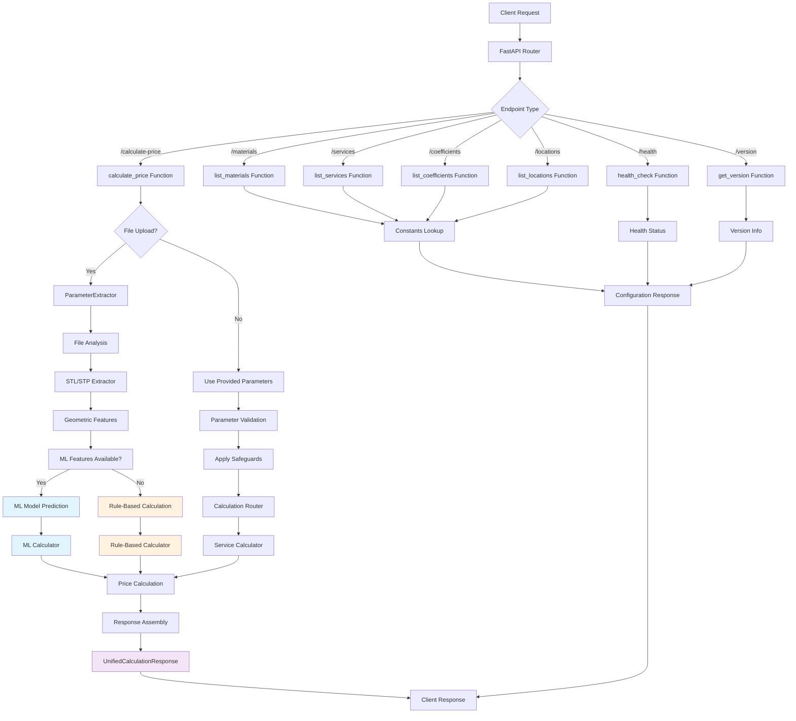

## 2. Endpoint Overview

This diagram shows all available endpoints and their purposes:

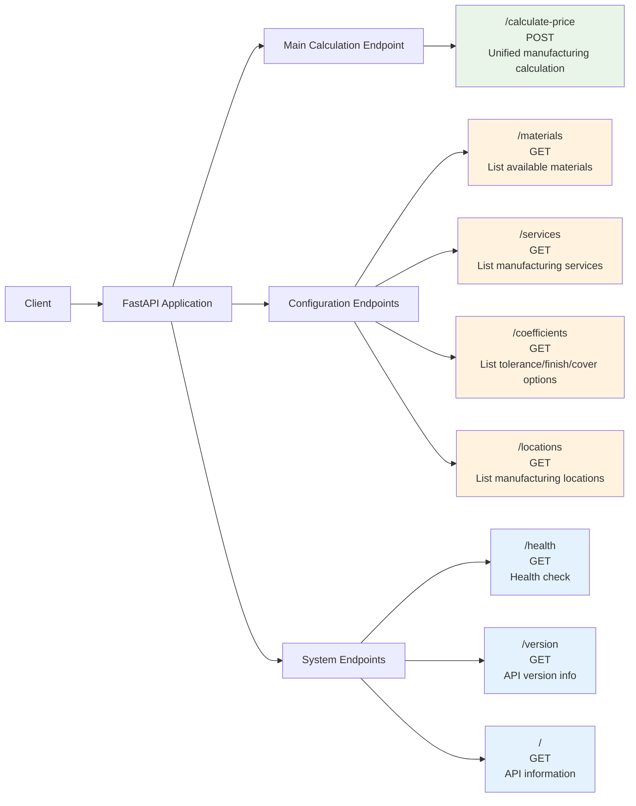

## 3. Detailed Function Call Diagrams

### 3.1 3D Printing Service Flow

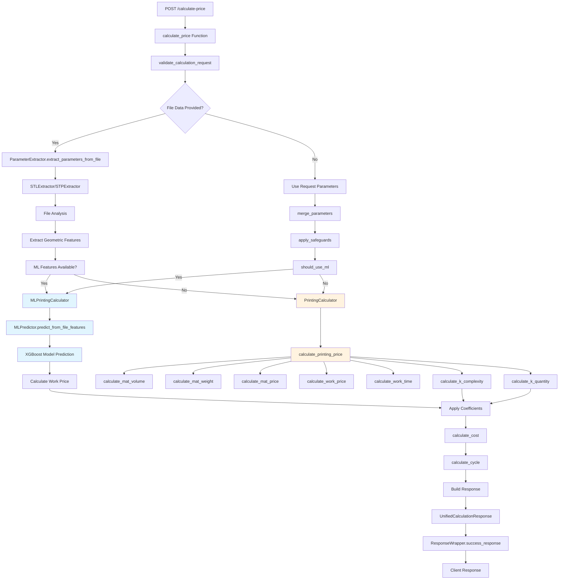

### 3.2 CNC Milling Service Flow

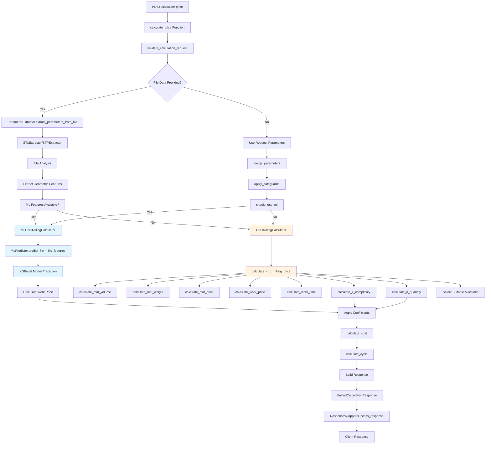

### 3.3 CNC Lathe Service Flow

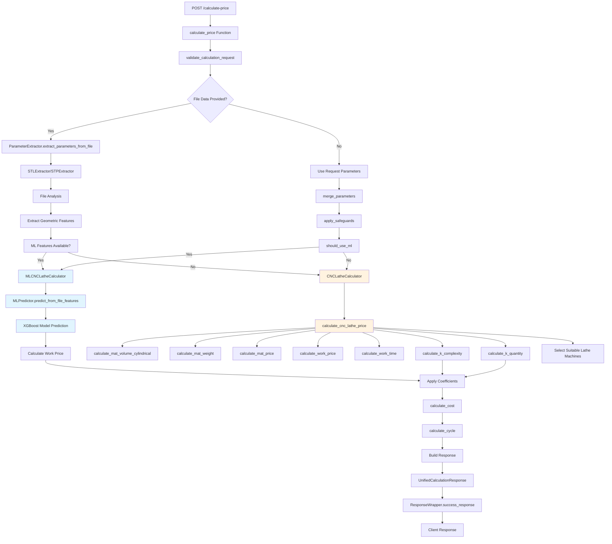

### 3.4 Painting Service Flow

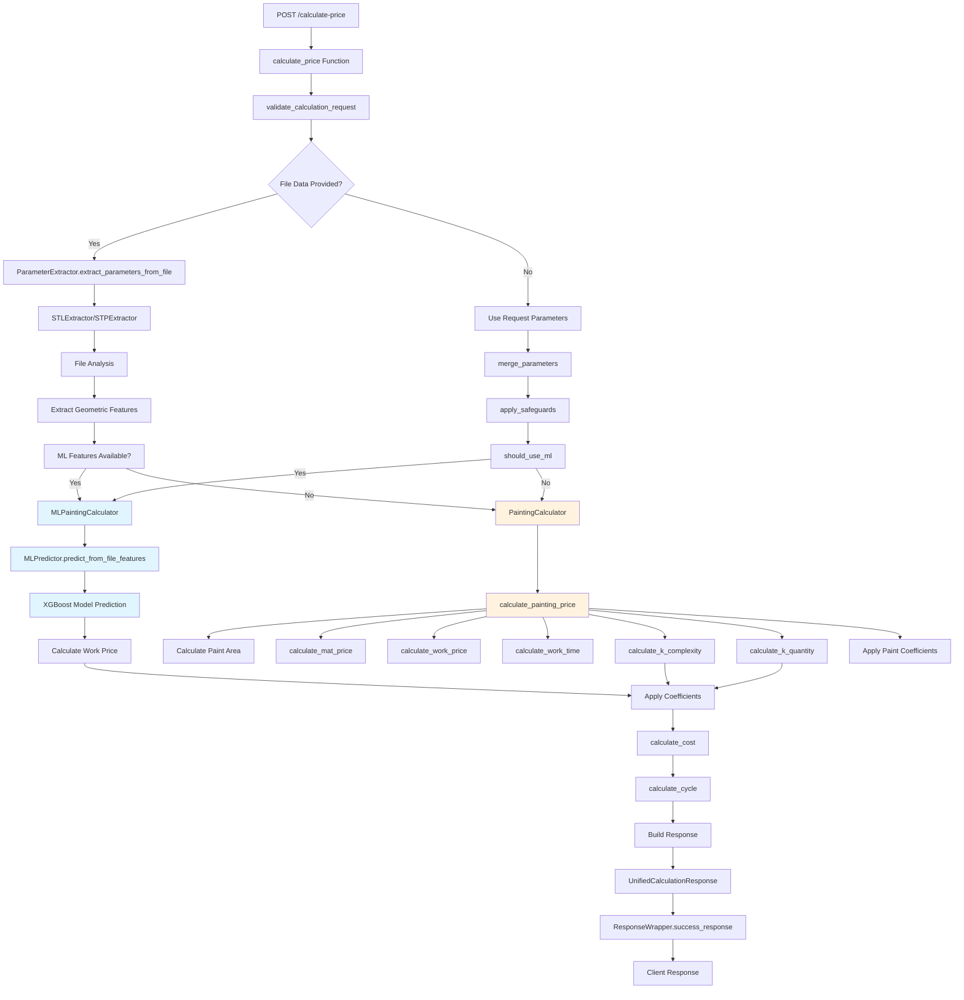
## 4. ML Model Integration Flow UPDATED

This detailed diagram shows how ML models are integrated into the calculation process with enhanced file extraction details:

```mermaid
graph TD
    A[UnifiedCalculationRequest] --> B[main.py<br>.post&#40/calculate-price&#41]
    B --> C[main.py<br>validation_errors]
    C --> D[utils.validation_utils.py<br>validate_calculation_request&#40;material_id, material_form, dimensions, quantity, tolerance_id, finish_id, cover_id, file_data, file_name, file_type&#41;]
    D --> AAA[main.py<br>validation_errors]
    AAA --> AAB[utils.validation_utils.py<br>create_validation_error_response<br>utils.response_utils.py<br>ResponseWrapper.error_response]

    AAA --> |Step 1: Extract parameters from file if provided| AAC[main.py<br>if request.file_data and request.file_name and request.file_type]
    AAC --> AAD[utils.parameter_extractor.py<br>extract_parameters_from_file]
    AAD --> E{File Type?}
    E -->|STL| F[STLExtractor]
    E -->|STP| G[STPExtractor]

    F --> H[extractors.stl_extractor.py]
    H --> I[extractors.file_extractor.py<br>_save_temp_file]
    I --> J[extractors.stl_extractor.py_analyze_stl_file]
    I --> K[volume, surface area]
    I --> L[features: face, vertex, edge counts]
    I --> M[ml‑compatible:<br>obb; min, mid, max sizes;<br>aspect_ratios; check_sizes_for_lathe]

    G --> O[extractors.stp_extractor.py]
    O --> P[extractors.file_extractor.py<br>_save_temp_file]
    P --> Q[min_obb and derives]
    P --> R[volume, surfaces and generals]
    P --> S[surface and edges features and its derives]

    K --> U[extractors.file_extractor.py<br>_cleanup_temp_file]
    L --> U
    M --> U
    Q --> U
    R --> U
    S --> U

    U --> V[main.py<br>if extracted_params.get&#40'volume'&#41<br>and extracted_params.get&#40'surface_area'&#41]
    V --> W[main.py<br>ml_features=extracted_params]

    W --> |Step 2: Merge extracted parameters with request parameters| WWA[utils.parameter_extractor.py<br>merge_parameters]
    WWA --> WWB[main.py<br>if ml_features]
    WWB --> WWD[main.py<br>merged_params&#91'ml_features'&#93=ml_features]

    WWD --> |Step 3: Apply safeguards for missing parameters| WWE[utils.safeguards.py<br>apply_safeguards]
    WWE --> WWF[apply defaults, dimensions, material_id, material_form]

    WWF --> |Step 4: Determine calculation method and route| WWG[utils.calculation_router.py<br>should_use_ml]
    WWG --> WWH[utils.calculation_router.py<br>if not ENABLE_ML_MODELS or not ml_predictor.is_model_available]
    WWG --> WWI[utils.calculation_router.py<br>if service_id not in &#91cnc-milling, cnc-lathe&#93]
    WWG --> WWJ[utils.calculation_router.py<br>if not ml_features]
    WWG --> WWK[utils.calculation_router.py<br>if not &#91'volume', 'surface_area'&#93 in ml_features]
    WWG --> WWL[utils.calculation_router.py<br>route_calculation]
    WWH --> WWM[rule‑based calculations]
    WWI --> WWM
    WWJ --> WWM
    WWK --> WWM

    WWL --> WWN[utils.calculation_router.py<br>_get_calculator]
    WWN --> WWO[calculators.ml_calculator.py<br>suitable_machines]
    WWO --> WWP[calculations.core.py<br>check_machines]
    WWP --> WWO
    WWO --> WWQ[calculators.ml_calculator.py<br>material_info]
    WWQ --> WWR[calculations.core.py<br>get_material_info]
    WWR --> WWQ
    WWQ --> WWS[calculators.ml_calculator.py<br>predicted_hours, is_need_special_equipment]
    WWS --> WWT[utils.ml_predictor.py<br>predict_from_file_features]

    WWT --> BB[utils.ml_predictor.py<br>extract_features_from_file<br>extract features and define zero material properties]

    BB --> CC[utils.ml_predictor.py<br>preprocess_features<br>update material info, map material_bar to russian,<br>define and transform categoricals, scaler features,<br>predict by clusterer and transform by reducer,<br>reindex by xgb regressor]

    CC --> HH[utils.ml_predictor.py<br>predict_work_time<br>predict by xgb regressor]
    HH --> II[utils.ml_predictor.py<br>predict_is_need_special_equipment<br>predict bool by xgb classifier]
    II --> JJ[calculators.ml_calculator.py<br>if predicted_hours is None or is_need_special_equipment is None]
    JJ --> KK[ValueError]
    JJ --> LL[calculators.ml_calculator.py<br>k_quantity]
    LL --> MM[calculations.core.py<br>calculate_k_quantity]
    MM --> LL
    LL --> NN[calculators.ml_calculator.py<br>k_cover]
    NN --> OO[calculations.core.py<br>calculate_cover_coefficient]
    OO --> NN
    NN --> PP[calculators.ml_calculator.py<br>_calculate_material_costs]
    PP --> QQ[calculators.ml_calculator.py<br>material_data]
    QQ --> RR[calculations.core.py<br>get_material_info]
    RR --> QQ
    QQ --> SS[calculators.ml_calculator.py<br>price_special_equipment, part_price, part_price_one]
    SS --> TT[calculations.core.py<br>calculate_cost]
    TT --> SS
    SS --> UU[calculators.ml_calculator.py<br>manufacturing_cycle]
    UU --> VV[calculations.core.py<br>calculate_cycle]
    VV --> UU
    UU --> WW[calculators.ml_calculator.py<br>_create_base_response<br>UnifiedCalculationResponse]
    WW --> |Step 5: Add file information and calculation engine info| AAAA[main.py<br>if request.file_name]
    AAAA --> BBBB[main.py<br>if extracted_params.get&#40'extracted_dimensions'&#41]
    BBBB --> CCCC[main.py<br>ResponseWrapper.success_response]
    CCCC --> DDDD[utils.response_utils.py<br>success_response]
    DDDD --> EEEE[utils.response_utils.py<br>if request_id]
    EEEE --> FFFF[utils.response_utils.py<br>if metadata]
    FFFF --> GGGG[utils.response_utils.py<br>response]
```

## 4. ML Model Integration Flow OLD

This detailed diagram shows how ML models are integrated into the calculation process with enhanced file extraction details:

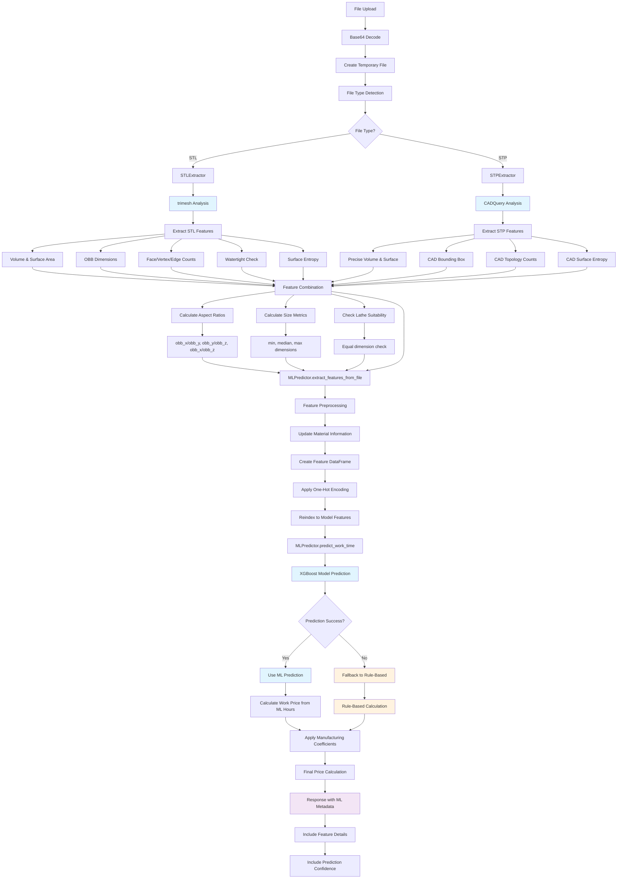

## 5. Configuration Endpoints Flow

This diagram shows how configuration endpoints retrieve data:

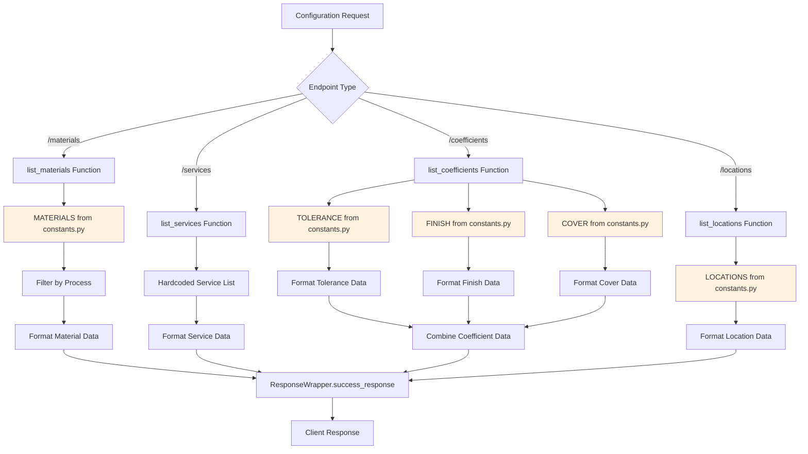

## 6. File Extraction Pipeline Flow

This detailed diagram shows the complete file extraction process for both STL and STP files:

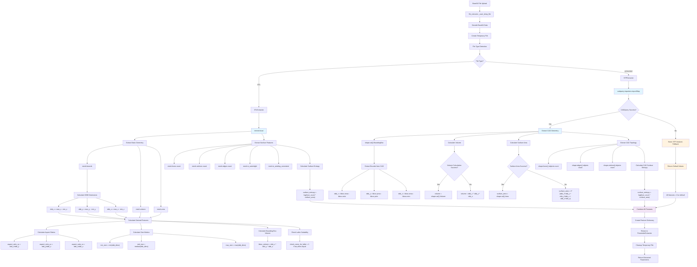

## 7. STL vs STP Processing Comparison

This diagram shows the key differences between STL and STP processing:

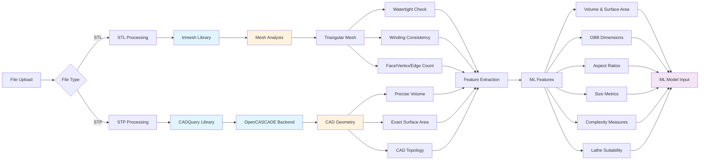

## 8. Error Handling Flow

This diagram shows how errors are handled throughout the system:

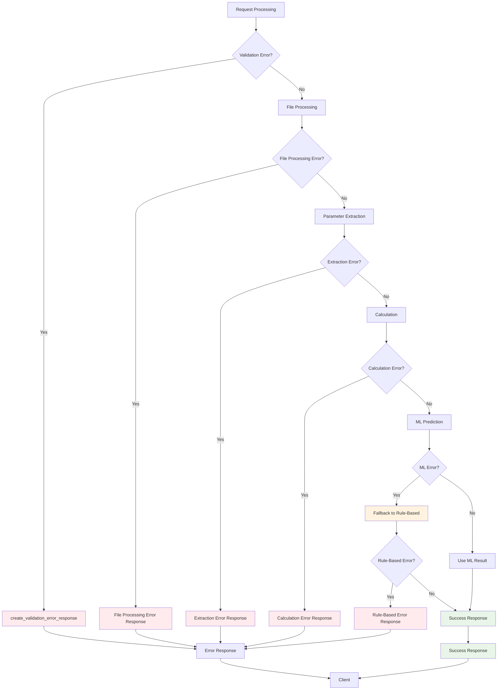

## Key Function Call Patterns

### Main Calculation Flow
1. **Entry**: `main.py:calculate_price()`
2. **Validation**: `validation_utils:validate_calculation_request()`
3. **File Processing**: `parameter_extractor:extract_parameters_from_file()`
4. **Safeguards**: `safeguards:apply_safeguards()`
5. **Routing**: `calculation_router:route_calculation()`
6. **Calculation**: Service-specific calculator
7. **Response**: `response_utils:ResponseWrapper.success_response()`

### ML Integration Flow
1. **Feature Extraction**: `extractors:STLExtractor/STPExtractor`
2. **ML Processing**: `ml_predictor:extract_features_from_file()`
3. **Preprocessing**: `ml_predictor:preprocess_features()`
4. **Prediction**: `ml_predictor:predict_work_time()`
5. **Fallback**: Automatic fallback to rule-based on failure

### Configuration Flow
1. **Request**: Configuration endpoint
2. **Data Lookup**: Constants from `constants.py`
3. **Formatting**: Service-specific formatting
4. **Response**: `ResponseWrapper.success_response()`

## 9. Technical Implementation Details

### STL Processing Technical Details
- **Library**: `trimesh` - Python library for 3D mesh processing
- **File Format**: STL (STereoLithography) - triangular mesh representation
- **Key Operations**:
  - `mesh.bounds` - Get axis-aligned bounding box
  - `mesh.volume` - Calculate mesh volume using divergence theorem
  - `mesh.area` - Calculate surface area from triangle faces
  - `mesh.is_watertight` - Check if mesh forms closed surface
  - `mesh.is_winding_consistent` - Check normal vector consistency
- **Performance**: Optimized for large meshes, memory-efficient processing
- **Limitations**: Approximate volume calculation, no parametric geometry

### STP Processing Technical Details
- **Library**: `CADQuery` with `OpenCASCADE` backend
- **File Format**: STEP (Standard for Exchange of Product Data) - parametric CAD
- **Key Operations**:
  - `cq.importers.importStep()` - Load STEP file with full geometric fidelity
  - `shape.val().BoundingBox()` - Get precise CAD bounding box
  - `shape.val().Volume()` - Calculate exact volume from CAD geometry
  - `shape.val().Area()` - Calculate exact surface area
  - `shape.faces().objects` - Access CAD topology
- **Performance**: Handles complex assemblies, parametric models
- **Advantages**: Precise calculations, full geometric fidelity

### ML Feature Engineering
- **Geometric Features**: Volume, surface area, OBB dimensions
- **Shape Features**: Aspect ratios, size metrics, compactness
- **Complexity Features**: Face count, vertex count, surface entropy
- **Manufacturing Features**: Lathe suitability, material compatibility
- **Preprocessing**: One-hot encoding for categorical features
- **Model Input**: 50+ features for XGBoost prediction

### Error Handling Strategy
- **File Processing**: Graceful fallback with default values
- **ML Prediction**: Automatic fallback to rule-based calculation
- **CAD Analysis**: Multi-level fallback (CADQuery → basic → defaults)
- **Validation**: Comprehensive parameter validation and safeguards

### Performance Characteristics
- **STL Processing**: < 2 seconds for typical files
- **STP Processing**: < 3 seconds for complex CAD files
- **ML Prediction**: < 100ms for work time estimation
- **Memory Usage**: Optimized for large file processing
- **Concurrent Processing**: Supports multiple simultaneous requests

## 10. STL ML Feature Extraction Process Flow

This detailed diagram shows the exact step-by-step process of extracting ML features from STL files, including all calculations, transformations, and data structures.

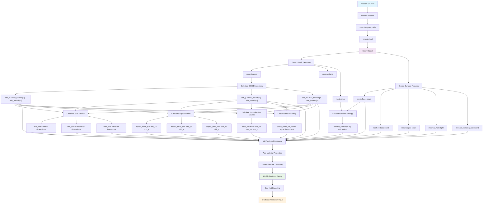

### STL Feature Extraction Technical Details

#### 1. File Input Processing
- **Input**: Base64 encoded STL file string
- **Process**: `base64.b64decode(file_data)` → binary data
- **Output**: Temporary file saved to disk

#### 2. Trimesh Mesh Loading
- **Function**: `trimesh.load(str(file_path))`
- **Creates**: Mesh object with vertices, faces, and edges
- **Properties**: Geometric properties automatically calculated

#### 3. Basic Geometry Extraction
```python
# Extract bounding box coordinates
bounds = mesh.bounds  # Returns [[x_min, y_min, z_min], [x_max, y_max, z_max]]
min_bounds = bounds[0]
max_bounds = bounds[1]

# Extract volume and surface area
volume = mesh.volume  # Calculated using divergence theorem
surface_area = mesh.area  # Sum of all triangle face areas
```

#### 4. OBB (Oriented Bounding Box) Calculations
```python
# Calculate OBB dimensions
obb_x = max_bounds[0] - min_bounds[0]  # Length
obb_y = max_bounds[1] - min_bounds[1]  # Width  
obb_z = max_bounds[2] - min_bounds[2]  # Height
```

#### 5. Size Metrics Calculations
```python
# Calculate size statistics
obb_dims = [obb_x, obb_y, obb_z]
min_size = min(obb_dims)           # Smallest dimension
mid_size = np.median(obb_dims)     # Median dimension
max_size = max(obb_dims)           # Largest dimension
```

#### 6. Aspect Ratios Calculations
```python
# Calculate aspect ratios with zero-division protection
aspect_ratio_xy = obb_x / obb_y if obb_y > 0 else 1.0
aspect_ratio_yz = obb_y / obb_z if obb_z > 0 else 1.0
aspect_ratio_xz = obb_x / obb_z if obb_z > 0 else 1.0
```

#### 7. Bounding Box Volume
```python
# Calculate bounding box volume
bbox_volume = obb_x * obb_y * obb_z
```

#### 8. Lathe Suitability Check
```python
# Check if any two dimensions are equal (within tolerance)
check_sizes_for_lathe = 1 if any(
    abs(obb_dims[i] - obb_dims[j]) < 0.001 
    for i in range(3) for j in range(i+1, 3)
) else 0
```

#### 9. Surface Features Extraction
```python
# Extract mesh topology and quality features
features = {
    'face_count': len(mesh.faces),                    # Number of triangular faces
    'vertex_count': len(mesh.vertices),               # Number of vertices
    'edge_count': len(mesh.edges),                    # Number of edges
    'is_watertight': mesh.is_watertight,              # Closed surface check
    'is_winding_consistent': mesh.is_winding_consistent,  # Normal consistency
    'surface_entropy': math.log(face_count * surface_area)  # Complexity metric
}
```

#### 10. ML Feature Dictionary Assembly
The final feature dictionary contains 50+ features organized into categories:

**Geometric Features (15 features)**:
- `volume`, `surface_area`, `obb_x`, `obb_y`, `obb_z`
- `min_size`, `mid_size`, `max_size`
- `aspect_ratio_xy`, `aspect_ratio_yz`, `aspect_ratio_xz`
- `bbox_volume`, `check_sizes_for_lathe`

**Surface Features (6 features)**:
- `num_faces`, `num_edges`, `num_vertices`
- `surface_entropy`, `is_watertight`, `is_winding_consistent`

**Material Features (5 features)**:
- `material_bar`, `material_name`, `material_name_main`
- `material_group`, `material_coef`

**File Features (2 features)**:
- `filename`, `file_type`

**Additional Features (25+ features)**:
- Service-specific parameters
- Manufacturing coefficients
- Quality control parameters
- Process-specific features

#### 11. Data Flow Summary
1. **Base64 STL** → **Binary File** → **Trimesh Mesh**
2. **Mesh Object** → **Geometric Properties** → **Calculated Features**
3. **Raw Features** → **ML Predictor** → **Processed Features**
4. **Feature Dictionary** → **One-Hot Encoding** → **XGBoost Input**

#### 12. Error Handling
- **File Loading Errors**: Returns default values (0.0 for dimensions, False for booleans)
- **Calculation Errors**: Zero-division protection, fallback values
- **Mesh Analysis Errors**: Graceful degradation with warning logs
- **Feature Extraction Errors**: Returns None, triggers rule-based fallback

#### 13. Performance Characteristics
- **File Size**: Handles STL files up to 100MB efficiently
- **Processing Time**: < 2 seconds for typical files
- **Memory Usage**: Optimized for large meshes
- **Feature Count**: 50+ features extracted per file

This comprehensive process ensures that STL files are thoroughly analyzed to extract all relevant geometric, topological, and manufacturing features needed for accurate ML-based work time prediction.

These diagrams provide a comprehensive view of how requests flow through the system, how different services are processed, and how ML integration works alongside traditional rule-based calculations.
