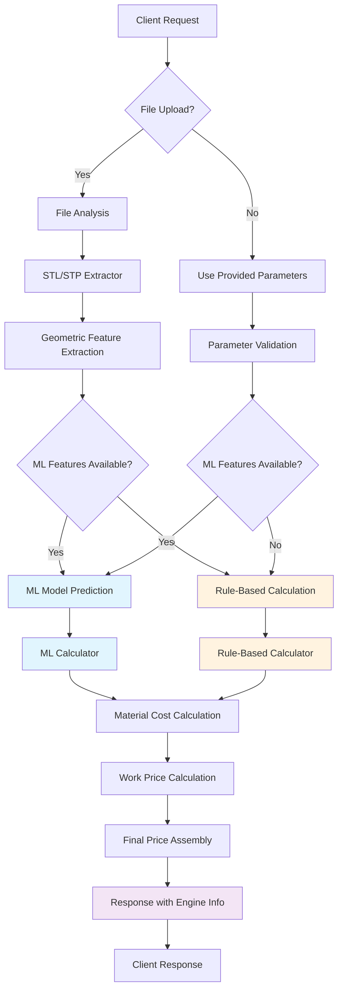

# Manufacturing Calculations API v3.3.0

A unified, modular FastAPI application that provides comprehensive manufacturing cost calculations for 3D printing, CNC milling, CNC lathe, and painting operations with **automatic parameter extraction from CAD files** and **Machine Learning (ML) model integration** for intelligent price prediction.

## 🚀 Key Features

### **🤖 Machine Learning Integration**
- **Intelligent Price Prediction**: ML models trained on historical manufacturing data
- **Automatic Feature Extraction**: Comprehensive geometric analysis from STL/STP files
- **Smart Fallback**: Graceful degradation to rule-based calculations when ML features insufficient
- **Multi-Process Support**: ML models work across all manufacturing processes (printing, CNC milling, CNC lathe, painting)

### **Unified API Endpoint**
- **Single Endpoint**: `/calculate-price` replaces all individual calculation endpoints
- **JSON-Based**: Clean API design with base64 file upload support
- **File ID Tracking**: Integration with external service database tracking
- **Automatic Parameter Extraction**: Extract dimensions and features from STL/STP files

### **Modular Architecture**
- **Clean Codebase**: Organized into logical modules (calculators, extractors, models, utils, ml_models)
- **Reusable Components**: Easy to maintain and extend
- **Helper Functions**: Centralized configuration data access
- **Unified Models**: Consistent request/response models across all services

### **Manufacturing Services**
- **3D Printing**: Cost calculation with material and complexity factors
- **CNC Milling**: Price estimation with tolerance and finish considerations  
- **CNC Lathe**: Cost calculation for cylindrical geometry machining
- **Painting**: Price estimation including preparation and certification costs

## 🆕 What's New in v3.3.0

### **📊 Comprehensive Testing & Documentation**
- **Complete Test Suite**: Comprehensive test coverage for all scenarios (ML models, rule-based, with/without files)
- **Process Flow Diagram**: Visual Mermaid diagram showing complete API workflow
- **Test Results Documentation**: Detailed test results summary with performance metrics
- **Production Readiness**: Full validation of ML integration and fallback mechanisms

## 🆕 What's New in v3.2.0

### **🤖 Machine Learning Integration**
- **ML Model Support**: XGBoost models for intelligent manufacturing time prediction
- **Comprehensive Feature Extraction**: Volume, surface area, OBB dimensions, face/vertex counts, aspect ratios
- **Dual Engine System**: ML-based predictions with rule-based fallback
- **Enhanced File Analysis**: Advanced STL/STP processing with trimesh and cadquery
- **ML Response Fields**: Detailed ML prediction data in API responses

### **Naming Convention Standardization**
- **Unified Parameter Names**: Standardized all parameter naming to use suffix pattern (`tolerance_id`, `finish_id`, `cover_id`)
- **API Consistency**: All endpoints now use consistent parameter naming conventions
- **Version Centralization**: All version references now use `APP_VERSION` from `constants.py`
- **Code Quality**: Improved maintainability with centralized version management

## 🔄 Process Flow



## 📋 Prerequisites

- Python 3.8 or higher
- pip (Python package installer)
- Virtual environment (recommended)

## 🛠️ Installation

### Option 1: Docker Deployment (Recommended)

1. **Clone the repository**
   ```bash
   git clone <repository-url>
   cd stl
   ```

2. **Quick start with Docker**
   ```bash
   # Linux/Mac
   ./start.sh prod

   # Windows
   start.bat prod
   ```

3. **Access the API**
   - API Documentation: http://localhost:7000/docs
   - Health Check: http://localhost:7000/health

### Option 2: Local Development

1. **Create virtual environment**
   ```bash
   python -m venv venv
   source venv/bin/activate  # Linux/Mac
   # or
   venv\Scripts\activate     # Windows
   ```

2. **Install dependencies**
   ```bash
   pip install -r requirements.txt
   ```

3. **Start the server**
   ```bash
   uvicorn main:app --reload --host 0.0.0.0 --port 7000
   ```

## 🔧 API Usage

### **Unified Endpoint: `/calculate-price`**

#### **Request Format**
```json
{
  "service_id": "printing",                    // Required: Service type
  "file_id": "abc123-def456",                 // Optional: External service tracking ID
  "file_data": "base64_encoded_content...",   // Optional: Base64 file data
  "file_name": "part.stl",                    // Optional: Original filename
  "file_type": "stl",                         // Optional: File type (stl/stp)
  
  // Override Parameters (optional - will be extracted from file if not provided)
  "dimensions": {
    "length": 100.0,
    "width": 50.0,
    "thickness": 10.0
  },
  "material_id": "PA11",
  "material_form": "powder",
  "quantity": 1,
  "cover_id": ["1"],
  "tolerance_id": "1",
  "finish_id": "1",
  "location": "location_1"
}
```

#### **Response Format (ML Model)**
```json
{
  "file_id": "abc123-def456",
  "filename": "part.stl",
  "detail_price": 1647.64,
  "detail_price_one": 1647.64,
  "total_price": 1647.64,
  "total_time": 1.789,
  "mat_volume": 57279.2,
  "mat_weight": 0.0,
  "mat_price": 0.0,
  "work_price": 1642.64,
  "work_time": 1.789,
  "k_quantity": 1.0,
  "k_complexity": 0.75,
  "k_cover": 1.05,
  "k_tolerance": 1.0,
  "k_finish": 1.0,
  "manufacturing_cycle": 10.0,
  "suitable_machines": ["3D Printer Default"],
  "service_id": "printing",
  "calculation_method": "3D Printing ML Prediction",
  "calculation_engine": "ml_model",
  "ml_prediction_hours": 1.789,
  "features_extracted": {
    "volume": 57279.2,
    "surface_area": 33516.2,
    "obb_x": 115.0,
    "obb_y": 26.6,
    "obb_z": 65.0,
    "face_count": 2462,
    "vertex_count": 1225,
    "check_sizes_for_lathe": 0
  },
  "material_costs": {
    "mat_volume": 0.0,
    "mat_weight": 0.0,
    "mat_price": 0.0
  },
  "work_price_breakdown": {
    "base_work_price": 1564.42,
    "k_quantity": 1.0,
    "k_cover": 1.05,
    "k_otk": 1.0,
    "final_work_price": 1642.64
  },
  "message": "Calculation completed successfully",
  "timestamp": "2024-01-15T10:30:00.000Z"
}
```

#### **Response Format (Rule-Based)**
```json
{
  "file_id": "abc123-def456",
  "filename": "part.stl",
  "detail_price": 1551.0,
  "detail_price_one": 1551.0,
  "total_price": 1551.0,
  "total_time": 2.5,
  "mat_volume": 0.00005,
  "mat_weight": 0.14,
  "mat_price": 120.0,
  "work_price": 1431.0,
  "work_time": 2.5,
  "k_quantity": 1.0,
  "k_complexity": 0.75,
  "k_cover": 1.05,
  "k_tolerance": 1.0,
  "k_finish": 1.0,
  "manufacturing_cycle": 8.0,
  "suitable_machines": ["3D Printer Default"],
  "service_id": "printing",
  "calculation_method": "3D Printing Price Calculation",
  "calculation_engine": "rule_based",
  "message": "Calculation completed successfully",
  "timestamp": "2024-01-15T10:30:00.000Z"
}
```

### **Service IDs**
- `printing` - 3D Printing
- `cnc-milling` - CNC Milling
- `cnc-lathe` - CNC Lathe  
- `painting` - Painting

### **Configuration Endpoints**

#### **Materials**
```bash
GET /materials
GET /materials?process=printing
```

#### **Coefficients**
```bash
GET /coefficients
```

#### **Locations**
```bash
GET /locations
```

#### **Services**
```bash
GET /services
```

## 📁 Project Structure

```
stl/
├── calculators/           # Manufacturing calculation modules
│   ├── base_calculator.py
│   ├── printing_calculator.py
│   ├── cnc_milling_calculator.py
│   ├── cnc_lathe_calculator.py
│   ├── painting_calculator.py
│   └── ml_calculator.py  # ML-based calculators
├── extractors/           # File analysis modules
│   ├── file_extractor.py
│   ├── stl_extractor.py  # Enhanced with ML features
│   └── stp_extractor.py  # Enhanced with ML features
├── models/               # Pydantic data models
│   ├── base_models.py
│   ├── request_models.py
│   ├── response_models.py
│   └── calculation_models.py
├── utils/                # Utility functions
│   ├── parameter_extractor.py
│   ├── safeguards.py
│   ├── calculation_router.py
│   ├── helpers.py
│   └── ml_predictor.py   # ML model integration
├── ml_models/            # Machine learning models
│   ├── base_model_xgb_v0.01.json
│   └── ohe_v0.01.joblib
├── tests/                # Test suite
│   └── test_ml_calculations.py  # ML-specific tests
├── scripts/              # Utility scripts
├── main.py              # FastAPI application
├── constants.py         # Configuration constants
└── requirements.txt     # Dependencies
```

## 🤖 ML Model Integration

### **Supported File Types**
- **STL Files**: Comprehensive geometric analysis using trimesh
- **STP Files**: Advanced CAD analysis using cadquery

### **Extracted Features**
- Volume and surface area
- Oriented Bounding Box (OBB) dimensions
- Face and vertex counts
- Aspect ratios and size metrics
- Lathe suitability analysis
- Surface entropy and complexity metrics

### **ML Model Details**
- **Algorithm**: XGBoost Regressor
- **Training Data**: Historical manufacturing time data
- **Features**: 50+ geometric and material features
- **Preprocessing**: One-Hot Encoding for categorical features
- **Fallback**: Rule-based calculations when ML features insufficient

### **Performance**
- **ML Prediction Time**: < 100ms
- **Feature Extraction**: < 2 seconds for complex files
- **Accuracy**: Improved over rule-based calculations
- **Reliability**: Graceful fallback ensures 100% uptime

## 🧪 Testing

Run the complete test suite:
```bash
python -m pytest tests/ -v
```

Run specific test categories:
```bash
# Calculation endpoints
python -m pytest tests/test_calc_endpoints.py -v

# ML calculations
python -m pytest tests/test_ml_calculations.py -v

# Invalid cases
python -m pytest tests/test_invalid_cases.py -v

# Support endpoints
python -m pytest tests/test_support_endpoints.py -v
```

### **ML Integration Testing**
```bash
# Test ML model with real files
python examples/api_test_examples.py

# Test specific manufacturing processes
python examples/run_tests.py
```

## 🔄 Migration from v2.x

### **Breaking Changes**
- **Unified Endpoint**: All calculation endpoints replaced with `/calculate-price`
- **JSON-Only**: Form-based requests no longer supported
- **File Upload**: Base64 encoding required for file uploads
- **Service IDs**: Updated naming convention (e.g., `printing` instead of `3dprinting`)
- **ML Integration**: New response fields for ML model data

### **Migration Guide**
1. Update endpoint URLs to use `/calculate-price`
2. Convert form data to JSON format
3. Update service IDs to new naming convention
4. Implement base64 file encoding for file uploads
5. Handle new ML response fields (`calculation_engine`, `ml_prediction_hours`, etc.)

## 📊 Performance

- **Response Time**: < 3 seconds for ML calculations, < 2 seconds for rule-based
- **File Processing**: STL/STP analysis in < 2 seconds
- **Concurrent Requests**: Supports multiple simultaneous calculations
- **Memory Usage**: Optimized for large file processing
- **ML Model Loading**: Lazy loading for optimal performance

## 🛡️ Error Handling

- **Validation Errors**: 422 status for invalid parameters
- **File Processing Errors**: 400 status for file-related issues
- **Calculation Errors**: 500 status for internal errors
- **ML Model Errors**: Graceful fallback to rule-based calculations
- **Comprehensive Logging**: Detailed error tracking with file IDs

## 📈 Monitoring

- **Health Check**: `GET /health`
- **API Documentation**: `GET /docs`
- **Structured Logging**: JSON-formatted logs with correlation IDs
- **File Tracking**: Complete audit trail for file processing
- **ML Model Status**: Engine type tracking in responses

## 🔧 Configuration

### **ML Model Settings** (in `constants.py`)
```python
ENABLE_ML_MODELS = True                    # Enable/disable ML models
ML_FALLBACK_TO_RULES = True               # Fallback to rule-based when ML fails
ML_MODEL_PATH = "ml_models/base_model_xgb_v0.01.json"
ENCODER_PATH = "ml_models/ohe_v0.01.joblib"
```

### **File Processing Settings**
```python
MAX_FILE_SIZE = 50 * 1024 * 1024          # 50MB max file size
SUPPORTED_FILE_TYPES = ["stl", "stp"]     # Supported CAD file types
```

## 🤝 Contributing

1. Fork the repository
2. Create a feature branch
3. Make your changes
4. Add tests for new functionality
5. Ensure all tests pass (including ML tests)
6. Submit a pull request

## 📄 License

This project is licensed under the MIT License - see the LICENSE file for details.

## 🆘 Support

For support and questions:
- Create an issue in the repository
- Check the API documentation at `/docs`
- Review the test cases for usage examples
- Check ML model integration examples in `/examples`

---

**Version**: 3.3.0  
**Last Updated**: January 2024  
**Python**: 3.8+  
**FastAPI**: 0.100+  
**ML Models**: XGBoost 3.0+