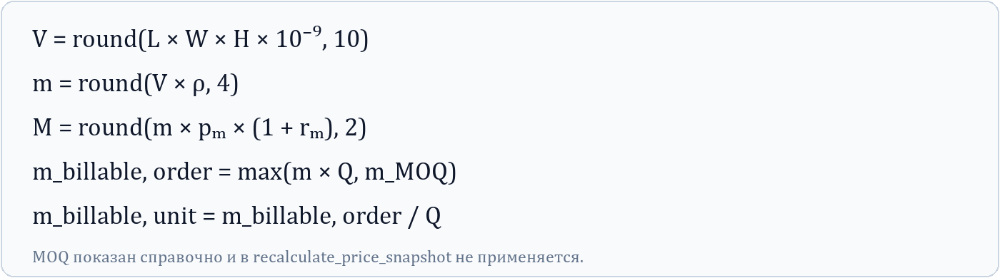
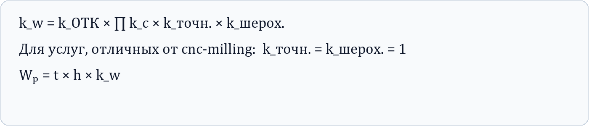
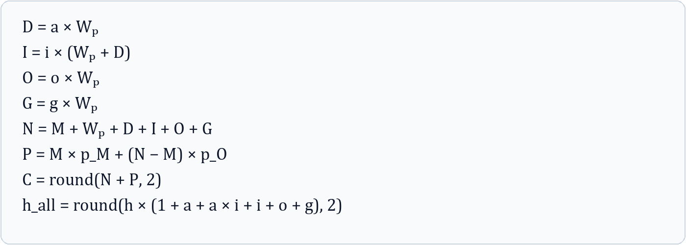
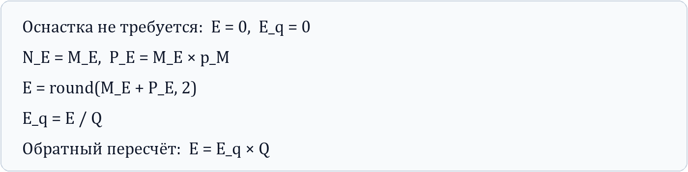
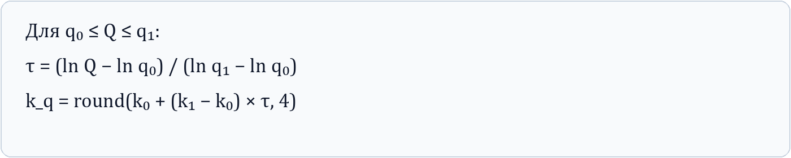
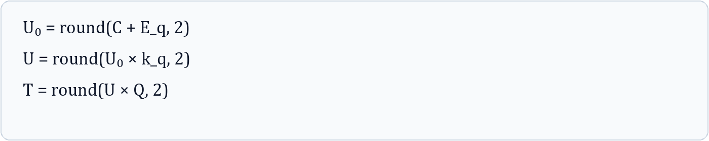
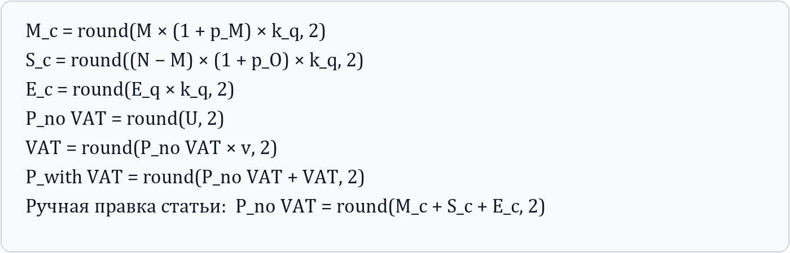
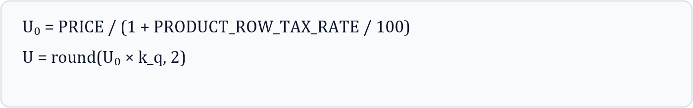
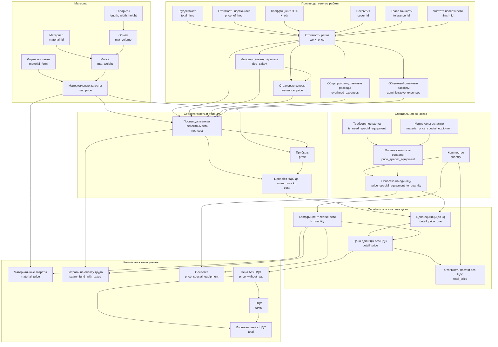

# Пересчёт стоимости изделия (`POST /recalculate-price`)

## 1. Назначение и область ответственности

Метод пересчитывает зависимые стоимостные показатели уже рассчитанного изделия после ручного изменения одного поля. В запрос передаётся полный снимок расчёта, а в query-параметре `changed_field` — точный JSON-путь изменённого поля.

```http
POST /recalculate-price?changed_field=total_price_breakdown.work_price
Content-Type: application/json
```

Механизм:

1. принимает новое значение указанного поля как исходное;
2. синхронизирует дублирующее поле, если значение представлено и на верхнем уровне, и в структуре стоимости;
3. передаёт изменённый узел в вычислительный граф Apache Hamilton и
   пересчитывает только его зависимые показатели;
4. возвращает полный обновлённый снимок.

Поля JSON преобразуются в плоские логические узлы только на границе графа.
Значения независимых узлов закрепляются через Hamilton `overrides`, поэтому
последующая правка не затирает ранее изменённые вручную показатели. Дублирующие
top-level и nested-пути синхронизируются при чтении и записи снимка.

Метод **не** запускает повторное чтение CAD-файла и ML-оценку трудоёмкости. Поэтому изменение технологии, материала или геометрии не является полным аналогом первоначального `/calculate-price`: вычисляется только доступная downstream-ветвь ценового графа.

За один запрос следует изменять одно поле. Если пользователь изменил несколько независимых значений, запросы нужно отправлять последовательно в порядке редактирования, каждый раз используя `data` предыдущего ответа как следующий снимок.

## 2. Термины и обозначения

| Обозначение | Поле модели | Смысл |
|---|---|---|
| `L, W, H` | `length`, `width`, `height` | габариты изделия, мм |
| `V` | `mat_volume` | объём материала, м³ |
| `ρ` | каталог материала: `density` | плотность, кг/м³ |
| `m` | `mat_weight` | масса материала на изделие, кг |
| `p_m` | форма материала: `price` | цена материала за кг |
| `r_m` | `MATERIAL_MARKUP_RATE` | наценка на материал, доля |
| `M` | `mat_price`, `total_price_breakdown.mat_price` | материальные затраты на одно изделие |
| `t` | `total_time`, `total_price_breakdown.total_time` | трудоёмкость, ч |
| `h` | `total_price_breakdown.price_of_hour` | базовая стоимость нормо-часа |
| `W_p` | `work_price`, `total_price_breakdown.work_price` | затраты на основную зарплату/производственные работы |
| `a, i, o, g` | коэффициенты `COST_STRUCTURE` | дополнительная зарплата, страхование, общепроизводственные и общехозяйственные расходы |
| `p_M, p_O` | `profit_material`, `other_profit` | нормы прибыли на материал и остальные затраты |
| `N` | `total_price_breakdown.net_cost` | производственная себестоимость |
| `P` | `total_price_breakdown.profit` | прибыль |
| `C` | `total_price_breakdown.cost` | цена без НДС до оснастки и коэффициента серийности |
| `E` | `total_price_breakdown.price_special_equipment` | полная стоимость специальной оснастки |
| `E_q` | `total_price_breakdown.price_special_equipment_to_quantity` | стоимость оснастки на одно изделие |
| `Q` | `quantity` | количество изделий |
| `k_q` | `k_quantity` | коэффициент серийности |
| `U_0` | `detail_price_one` | цена единицы до применения `k_q`, без НДС |
| `U` | `detail_price`, `total_price_breakdown.detail_price` | цена единицы после применения `k_q`, без НДС |
| `T` | `total_price` | стоимость всей партии без НДС |
| `v` | `VAT_RATE` | ставка НДС в коде как доля, например `0.22` |

Коммерческие коэффициенты берутся из `COST_STRUCTURE`:

- для `service_id == "printing"` — конфигурация `PRINTING_LOCATION`;
- для остальных услуг — `location_1`.

Фактические значения коэффициентов не зашиты в этот документ: источником истины является конфигурация развёрнутой версии приложения.

## 3. Полный набор формул

### 3.1. Геометрия, масса и материал

При заполненных трёх габаритах:



Множитель `10⁻⁹` переводит мм³ в м³.

Цена берётся у выбранной `material_form`. Если форма отсутствует, неприменима к услуге или имеет неположительную цену, выбирается первая применимая форма с положительной ценой; затем — первая применимая форма; в крайнем случае — первая форма материала. При этом `material_form` в возвращаемом снимке механизм не исправляет на фактически выбранную fallback-форму.

В `core.py` существует отдельный расчёт минимального заказа материала (MOQ):

Однако узел MOQ в граф `/recalculate-price` не входит. Цена материала считается
по фактической массе одного изделия, без MOQ. Это необходимо учитывать при
сравнении с первоначальным расчётом.

### 3.2. Стоимость производственных работ

Совокупный производственный коэффициент:



Последние два множителя используются только для `service_id == "cnc-milling"`. Для остальных технологий:

На этом этапе округление не выполняется. Если среди покрытий есть неизвестный
код, коэффициенты покрытий не применяются, то есть они не влияют на `k_w`.

### 3.3. Структура себестоимости

Пусть:

- `a` — `dop_salary_coef`;
- `i` — `insurance_coef`;
- `o` — `overhead_expenses_coef`;
- `g` — `administrative_expenses_coef`.

Тогда:



Обозначения результатов: `D` — дополнительная заработная плата (`dop_salary`), `I` — страховые взносы (`insurance_price`), `O` — общепроизводственные расходы (`overhead_expenses`), `G` — общехозяйственные расходы (`administrative_expenses`), `N` — производственная себестоимость (`net_cost`), `P` — прибыль, `C` — цена без НДС до оснастки и коэффициента серийности (`cost`).

Отображаемая стоимость нормо-часа с начислениями `h_all` записывается в `total_price_breakdown.price_of_hour_with_others`.

### 3.4. Специальная технологическая оснастка

Если оснастка не требуется:



Если вручную изменены материальные затраты на оснастку `M_E`, полная цена оснастки рассчитывается тем же `calculate_cost`, но при нулевой стоимости работ. При прямом изменении полной стоимости оснастки удельная стоимость равна `E / Q`; при прямом изменении удельной стоимости выполняется обратный пересчёт `E = E_q × Q`.

После вычислений оба значения оснастки округляются до двух знаков.

### 3.5. Коэффициент серийности

При изменении количества `Q` коэффициент `k_q` вычисляется кусочно-линейной интерполяцией в логарифмическом пространстве по контрольным точкам `QUANTITY_DISCOUNT_CONTROL_POINTS`.

Для соседних контрольных точек `(q₀, k₀)` и `(q₁, k₁)`:



До первой точки используется `k₀`, после последней — коэффициент последней точки. Некорректное или неположительное количество нормализуется до `Q = 1`.

### 3.6. Цена единицы и партии



Таким образом, коэффициент серийности применяется и к себестоимости с прибылью, и к распределённой стоимости оснастки.

### 3.7. Компактная калькуляция

`detail_price_calculation` группирует детальную структуру в три статьи:



Поля:

- `material_price` = `M_c`;
- `salary_fund_with_taxes` = `S_c`;
- `price_special_equipment` = `E_c`;
- `price_without_vat` = `P_no VAT`;
- `taxes` = VAT;
- `total` = `P_with VAT`;
- совместимые поля ответа `detail_price_one` и `detail_price_one_with_taxes` внутри компактной калькуляции соответственно равны цене без НДС и цене с НДС. Они не тождественны верхнеуровневому `detail_price_one`.

При прямом редактировании одной из трёх статей компактной калькуляции цена без НДС считается как их сумма, после чего обновляются НДС, цена единицы и цена партии.

## 4. Соответствие модели, формул и полей товара Bitrix24

### 4.1. Исходные данные

| Отображаемое имя в Bitrix24 | Код Bitrix24 | Поле модели/API | Операнд |
|---|---|---|---|
| Технология изготовления | `UP_CAT_SERVICE` | `service_id` | выбор правил `k_w` и локации |
| Идентификатор материала | `UP_CAT_MATERIAL` | `material_id` | источник `ρ`, `p_m` |
| Идентификатор класса чистоты поверхности | `UP_CAT_ROUGHNESS` | `finish_id` | `k_шерох.` |
| Идентификатор класса точности | `UP_CAT_ACCURACY` | `tolerance_id` | `k_точн.` |
| Идентификаторы финишных покрытий | `UP_CAT_FINISHING` | `cover_id` | `k_c` |
| Коэффициент технического контроля (ОТК) | `UP_CAT_CONTROL` | `k_otk` | `k_ОТК` |
| Извлечённая длина | `length` | `length` | `L` |
| Извлечённая ширина | `width` | `width` | `W` |
| Извлечённая высота | `height` | `height` | `H` |
| Объём материала, м³ | `UP_CAT_VOLUME` | `mat_volume` | `V` |
| Масса материала, кг | `UP_CAT_CONS_RATE` | `mat_weight` | `m` |
| Форма поставки материала | `UP_CAT_MATERIAL_FORM` | `material_form` | выбор `p_m` |
| Трудоёмкость изготовления | `UP_CAT_INTENSITY` | `total_time` | `t` |
| Коэффициент серийности | `UP_CAT_K_QUANTITY` | `k_quantity` | `k_q` |
| Требуется изготовление специальной технологической оснастки | `UP_CAT_NEED_SPEC_EQUIPMENT` | `is_need_special_equipment` | признак `E ≠ 0` |
| Количество товарной позиции | `QUANTITY` | `quantity` | `Q` |

Списочные поля Bitrix24 хранят отображаемое значение, но API пересчёта должен получить внутренний код калькулятора: `data.*[i].id` из `/materials`, `/auto_services`, `/other_services` и `/coefficients`. Для `cover_id` передаётся массив кодов.

### 4.2. Детальная структура стоимости

| Отображаемое имя в Bitrix24 | Код Bitrix24 | Поле модели/API | Операнд |
|---|---|---|---|
| Стоимость материала | `UP_CAT_MAT_PRICE` | `mat_price` | `M` |
| Структура стоимости — материальные затраты | `UP_CAT_MAIN_MAT` | `total_price_breakdown.mat_price` | `M` |
| Стоимость производственных работ | `UP_CAT_WORK_PRICE` | `work_price` | `W_p` |
| Структура стоимости — затраты на основную заработную плату | `UP_CAT_TPB_WORK_PRICE` | `total_price_breakdown.work_price` | `W_p` |
| Структура стоимости — трудоёмкость изготовления | `UP_CAT_TPB_TOTAL_TIME` | `total_price_breakdown.total_time` | `t` |
| Структура стоимости — стоимость нормо-часа | `UP_CAT_TPB_PRICE_OF_HOUR` | `total_price_breakdown.price_of_hour` | `h` |
| Стоимость нормочаса | `UP_CAT_STND_HR_COST` | `total_price_breakdown.price_of_hour_with_others` | `h_all` |
| Структура стоимости — дополнительная заработная плата | `UP_CAT_TPB_DOP_SALARY` | `total_price_breakdown.dop_salary` | `D` |
| Структура стоимости — страховые взносы | `UP_CAT_TPB_INSURANCE_PRICE` | `total_price_breakdown.insurance_price` | `I` |
| Структура стоимости — общепроизводственные расходы | `UP_CAT_TPB_OVERHEAD_EXPENSES` | `total_price_breakdown.overhead_expenses` | `O` |
| Структура стоимости — общехозяйственные расходы | `UP_CAT_TPB_ADMIN_EXPENSES` | `total_price_breakdown.administrative_expenses` | `G` |
| Структура стоимости — производственная себестоимость | `UP_CAT_TPB_NET_COST` | `total_price_breakdown.net_cost` | `N` |
| Структура стоимости — прибыль | `UP_CAT_TPB_PROFIT` | `total_price_breakdown.profit` | `P` |
| Структура стоимости — цена без НДС | `UP_CAT_TPB_COST` | `total_price_breakdown.cost` | `C` |
| Материалы для специальной оснастки | `UP_CAT_TPB_SPEC_EQUIP_MATERIAL` | `total_price_breakdown.material_price_special_equipment` | `M_E` |
| Стоимость специальной оснастки | `UP_CAT_TPB_PRICE_SPEC_EQUIPMENT` | `total_price_breakdown.price_special_equipment` | `E` |
| Стоимость специальной оснастки на единицу | `UP_CAT_SPEC_EQ_COST` | `total_price_breakdown.price_special_equipment_to_quantity` | `E_q` |
| Стоимость единицы продукции | `UP_CAT_TPB_DETAIL_PRICE` | `total_price_breakdown.detail_price` | `U` |

`mat_price` и `work_price` продублированы. Авторитетным является путь, переданный в `changed_field`; механизм копирует его значение во второй экземпляр.

### 4.3. Компактная калькуляция и товарная позиция

| Отображаемое имя в Bitrix24 | Код Bitrix24 | Поле модели/API | Операнд |
|---|---|---|---|
| Калькуляция — материальные затраты | `UP_CAT_DPC_MATERIAL_PRICE` | `detail_price_calculation.material_price` | `M_c` |
| Калькуляция — затраты на оплату труда | `UP_CAT_DPC_SALARY_WITH_TAXES` | `detail_price_calculation.salary_fund_with_taxes` | `S_c` |
| Калькуляция — специальная оснастка | `UP_CAT_DPC_SPEC_EQUIPMENT` | `detail_price_calculation.price_special_equipment` | `E_c` |
| Калькуляция — цена без НДС | `UP_CAT_DPC_PRICE_WITHOUT_VAT` | `detail_price_calculation.price_without_vat` | `P_no VAT` |
| Калькуляция — НДС | `UP_CAT_DPC_TAXES` | `detail_price_calculation.taxes` | VAT |
| Калькуляция — итоговая цена | `UP_CAT_DPC_TOTAL` | `detail_price_calculation.total` | `P_with VAT` |
| Цена товарной позиции | `PRICE` | формируется из `detail_price_one` | `U_0 × (1 + TAX_RATE / 100)` |
| Количество | `QUANTITY` | `quantity` | `Q` |
| Скидка, % | `DISCOUNT_RATE` | `round((1-k_quantity)*100)` | `100 × (1 - k_q)` |
| Ставка НДС, % | `TAX_RATE` | константа интеграции, сейчас 22 | процент |
| НДС включён в цену | `TAX_INCLUDED` | `"N"` | признак |

При обратной синхронизации из товарной позиции:



## 5. Вычислительный граф и каскады пересчёта

Формулы объявлены как узлы в `calculations/price_graph.py`; порядок выполнения
и минимальную downstream-ветвь определяет Apache Hamilton. Адаптер
`calculations/price_recalculation.py` отвечает только за контракт снимка:
алиасы, сохранение независимых значений и обратные маршруты для полей вроде
`total_price`.

Основной граф зависимостей:



При ручном изменении промежуточного узла его предки не пересчитываются. Например:

- изменение `net_cost` сохраняет статьи затрат и обновляет только `profit`, `cost` и цены;
- изменение `profit` сохраняет `net_cost`;
- изменение `dop_salary` сохраняет `work_price`, `overhead_expenses` и `administrative_expenses`, но обновляет страховые взносы и последующие итоги;
- изменение `detail_price_calculation.taxes` обновляет только `detail_price_calculation.total`.

## 6. Контракт запроса и ответа

Минимально для корректного ценового каскада снимок должен содержать:

- `quantity`;
- `total_price_breakdown`;
- `detail_price_calculation`;
- изменяемое поле по пути `changed_field`;
- все операнды, необходимые ветви расчёта.

Пример:

```json
{
  "service_id": "cnc-milling",
  "material_id": "non_ferrous_Д16",
  "material_form": "sheet",
  "k_otk": 1.0,
  "cover_id": ["1"],
  "finish_id": "1",
  "tolerance_id": "1",
  "total_time": 0.65,
  "quantity": 40,
  "k_quantity": 0.91,
  "mat_price": 120.0,
  "work_price": 475.0,
  "total_price_breakdown": {
    "mat_price": 120.0,
    "total_time": 0.65,
    "price_of_hour": 732.91818,
    "work_price": 475.0,
    "is_need_special_equipment": true,
    "material_price_special_equipment": 250.0,
    "price_special_equipment": 800.0,
    "price_special_equipment_to_quantity": 20.0
  },
  "detail_price_calculation": {
    "material_price": 0.0,
    "salary_fund_with_taxes": 0.0,
    "price_special_equipment": 0.0,
    "price_without_vat": 0.0,
    "taxes": 0.0,
    "total": 0.0
  }
}
```

Успешный ответ использует стандартную обёртку:

```json
{
  "success": true,
  "message": "Price recalculated from total_price_breakdown.work_price",
  "data": {
    "...": "полный обновлённый снимок"
  },
  "timestamp": "2026-08-25T11:24:00",
  "version": "3.0.0"
}
```

`changed_field` поддерживает путь глубиной не более двух сегментов. Несуществующий путь, `null` в изменённом поле или путь большей глубины приводят к ошибке валидации.
