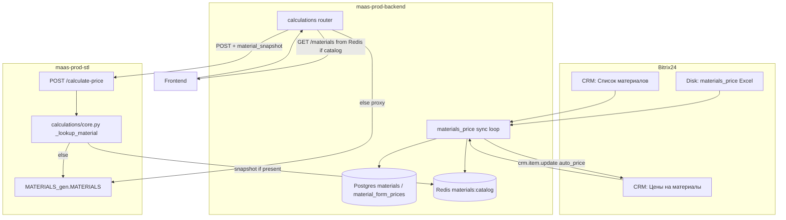
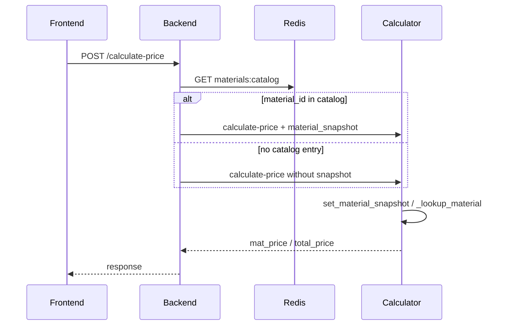

# Materials price sync (backend + backend-stl)

This document describes how material catalog prices move from Bitrix / Excel into
runtime pricing after the standalone `maas-materials-price` service was absorbed
into **maas-prod-backend**, with a thin companion change in **maas-prod-stl**
(backend-stl / calculator).

There is **no separate materials-price deployable**. Sync runs inside the existing
backend process tree (same pattern as Bitrix reverse-sync). Traefik, frontend, and
SRE configs are unchanged.

## Roles

| Component | Repo / path | Responsibility |
|-----------|-------------|----------------|
| Price ETL + catalog store | `maas-prod-backend` → `backend/materials_price/` | Download Excel from Bitrix disk, match rows, write CRM `auto_price`, upsert Postgres, publish Redis catalog |
| API gateway | `maas-prod-backend` → `backend/calculations/` | `GET /materials` from Redis when populated; inject `material_snapshot` into `POST /calculate-price` |
| Pricing engine | `maas-prod-stl` | Geometry + cost math; local `MATERIALS_gen.MATERIALS` fallback; optional per-request `material_snapshot` override |
| Retired | `maas-materials-price` | Former standalone daemon that wrote `MATERIALS_gen.py` only; replaced by backend sync |

## End-to-end scheme



## Sync logic (backend)

Enabled with `MATERIALS_SYNC_ENABLED=true` (default **false**). Interval:
`MATERIALS_SYNC_INTERVAL_SECONDS` (default `60`).

Started from backend startup via `start_materials_sync_process` (child process,
like reverse-sync). Uses existing `BITRIX24_WEBHOOK_URL` / `BitrixClient`.

### One sync cycle

1. Load CRM smart processes (`MATERIALS_CRM_NAME`, `MATERIALS_PRICE_CRM_NAME`).
2. Download `.xls` / `.xlsx` from Bitrix disk path `MATERIALS_DISK_PATH`.
3. Parse rows (name, units, price, date) with `openpyxl`.
4. Match material + semi-finished form via:
   - GOST / OST / TU patterns → `data/gost_by_form.json`
   - name synonyms (steel grades, forms, units)
   - unit validation against CRM `PriceUnits`
5. Aggregate prices per `(material_id, form)`: sort by date, mean, drop outliers
   above `5×` mean.
6. Write **`AutoPrice`** back to Bitrix price CRM items.
7. Build MATERIALS-shaped catalog from CRM rows with **`ManualPrice > 0`**.
8. Upsert Postgres tables `materials` / `material_form_prices`.
9. Publish JSON catalog to Redis key `materials:catalog`.

### Runtime wiring (backend)

- **`GET /materials`**: if `MATERIALS_SYNC_SERVE_CATALOG=true` and Redis has priced
  entries (beyond placeholder `other`), serve that list; otherwise proxy to the
  calculator as before.
- **`POST /calculate-price`**: look up `material_id` in Redis; if found, pass
  `material_snapshot` in the calculator payload.

### Config (backend `.env`)

```env
MATERIALS_SYNC_ENABLED=false
MATERIALS_SYNC_INTERVAL_SECONDS=60
MATERIALS_SYNC_SERVE_CATALOG=true
MATERIALS_CRM_NAME=Список материалов
MATERIALS_PRICE_CRM_NAME=Цены на материалы
MATERIALS_DISK_PATH=Общий диск/materials_price
```

## Calculator side (backend-stl)

Local catalog still comes from `MATERIALS_gen.py` (imported as `MATERIALS`), with
optional hot-reload helpers in `main.py`.

### `material_snapshot` override

Request field on `UnifiedCalculationRequest`:

- `material_snapshot: Optional[Dict]` — one MATERIALS entry (label, density,
  forms with prices, applicable_processes, …).

On `POST /calculate-price`:

1. If `material_snapshot` + `material_id` are set →
   `set_material_snapshot(material_id, snapshot)`.
2. Calculation uses `_lookup_material()` in `calculations/core.py`.
3. Snapshot is cleared in `finally` (request-scoped `ContextVar`).



Fallback order inside `_lookup_material`:

1. Per-request snapshot (from backend Redis catalog)
2. `MATERIALS_gen.MATERIALS`

Pricing math (markup, MOQ, unified pipeline) stays in the calculator — backend
does not recompute material unit cost.

## Data shape (catalog entry)

Synced / snapshot entries follow the MATERIALS dict shape used by the calculator,
for example:

```python
{
  "steel_Ст45": {
    "label": "Сталь Ст45",
    "family": "carbon",
    "density": 7850.0,
    "minimum_order_quantity": 10.0,
    "applicable_processes": ["cnc-milling", "electroplating_auto"],
    "forms": {
      "rod": {"price": 123.45, "applicable_processes": ["cnc-milling", "..."]},
      "sheet": {"price": 130.0, "applicable_processes": ["cnc-milling", "..."]}
    }
  }
}
```

Bitrix **manual** price feeds the catalog / calculator path. Bitrix **auto** price
is market feedback from Excel and is stored on CRM (and optionally in Postgres
`auto_price`) for ops visibility.

## What was removed / not done

- No new Docker/compose service for materials-price
- No Traefik / frontend / SRE changes
- Frontend API paths stay `/materials` and `/calculate-price`
- Standalone `maas-materials-price` is obsolete for production sync

## Related code

**Backend**

- `backend/materials_price/sync.py` — sync cycle
- `backend/materials_price/catalog.py` — Redis / Postgres
- `backend/bitrix24/async_queue/process.py` — process start/stop
- `backend/calculations/proxy.py` — materials list
- `backend/calculations/router.py` / `service.py` — snapshot injection

**Calculator (this repo)**

- `MATERIALS_gen.py` — local MATERIALS fallback
- `calculations/core.py` — `_lookup_material`, snapshot context
- `models/request_models.py` — `material_snapshot` field
- `main.py` — set/clear snapshot around calculate-price
